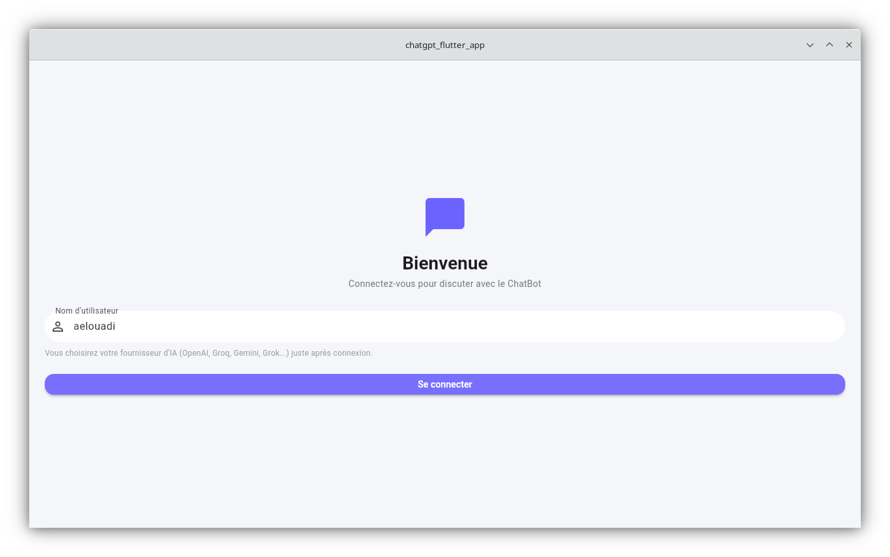
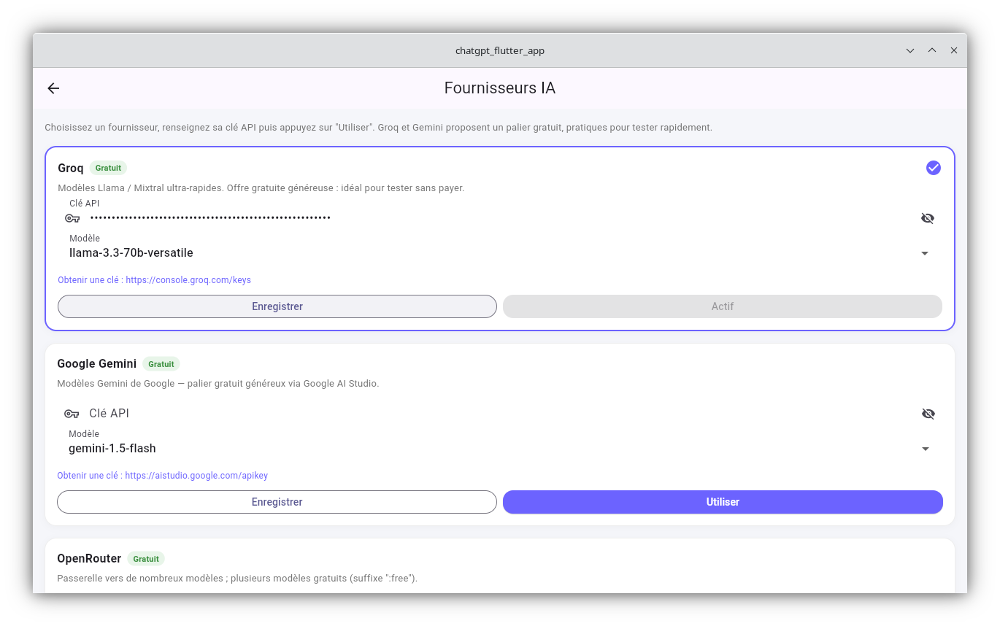
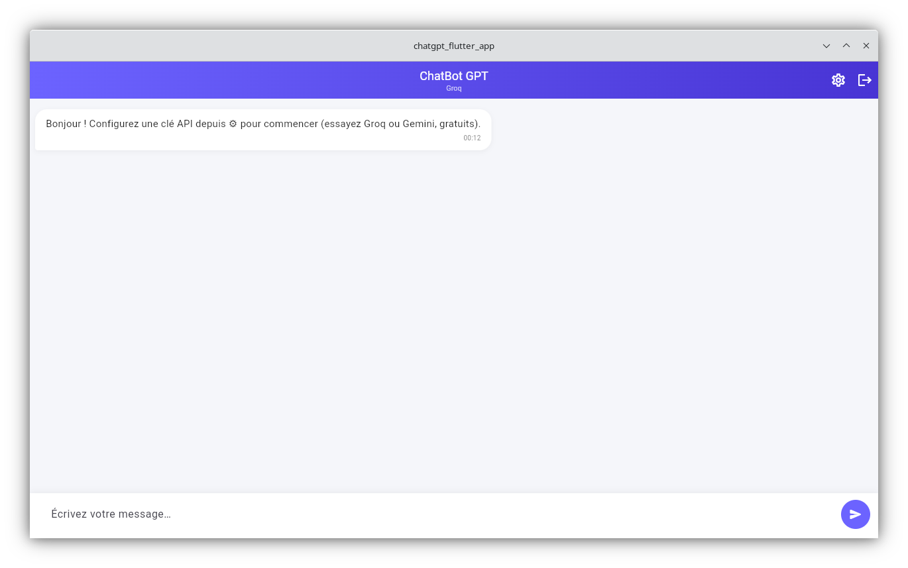
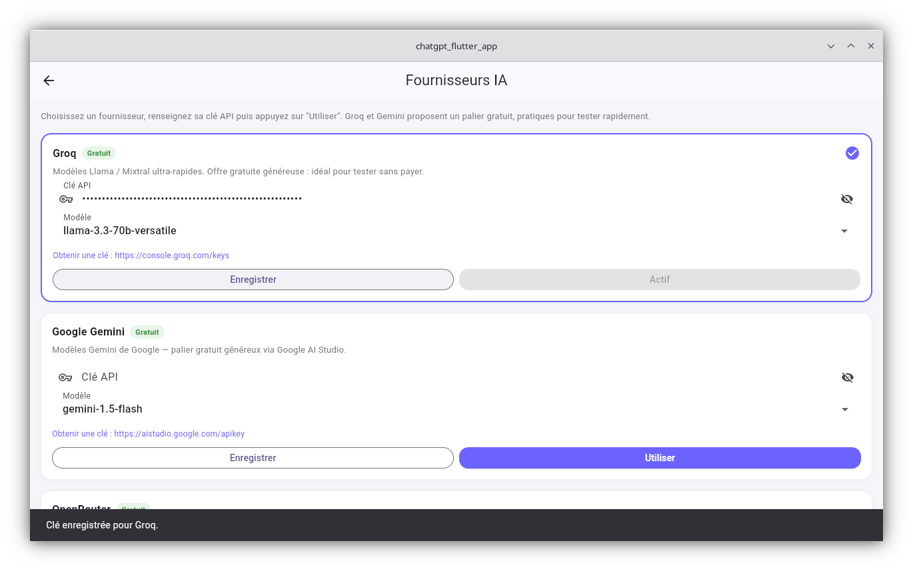
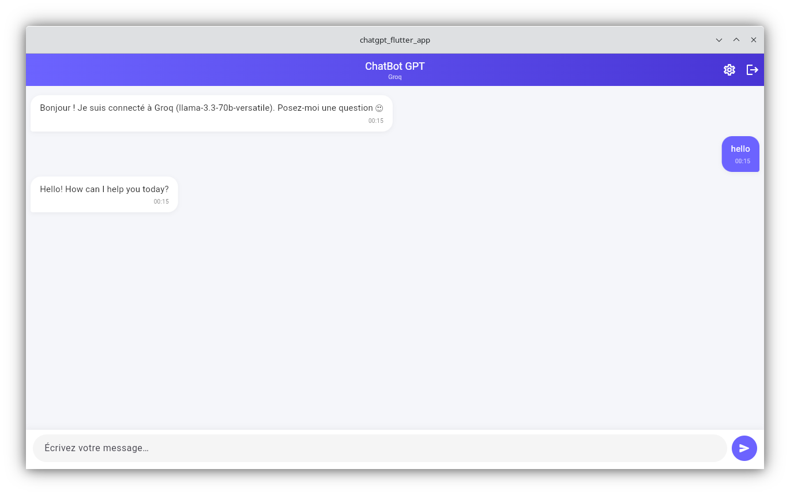
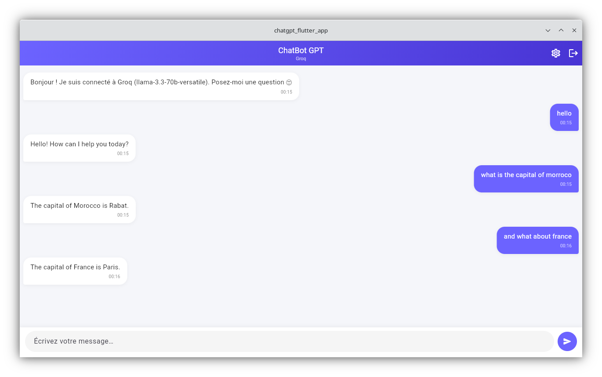

# ChatBot GPT — Application Flutter

Application ChatBot qui interagit avec l'API ChatGPT (OpenAI), réalisée pour le
projet final du module "Gestion des données et personnalisation de UI avec Flutter".

## Aperçu de l'application

| Connexion | Chat sans clé configurée |
|---|---|
|  |  |

| Paramètres — Groq activé | Paramètres — liste des fournisseurs |
|---|---|
|  |  |

| Confirmation de sauvegarde | Premier échange |
|---|---|
|  |  |

**Conversation complète avec Groq (modèle `llama-3.3-70b-versatile`) :**



## Fonctionnalités (au-delà de la version minimaliste du blog)

| Exigence du projet      | Implémentation |
|--------------------------|----------------|
| **Design**               | Thème Material 3 personnalisé, dégradé violet, bulles de discussion avec coins arrondis asymétriques, ombres douces, écran de démarrage animé. |
| **Comportement**          | Indicateur de saisie animé (3 points), défilement automatique, gestion des erreurs API affichée comme message dans le chat, validation de formulaire. |
| **Navigation**            | `onGenerateRoute` centralisé dans `main.dart` + `Navigator.pushNamed`, `pushReplacementNamed`, `pop` (Splash → Login → Chat → Settings), exactement les méthodes vues en cours. |
| **Authentification**      | Écran de connexion (nom d'utilisateur), état persisté avec `SharedPreferences`, redirection automatique si déjà connecté, déconnexion avec confirmation. |
| **Animation**              | Fade + scale sur le splash screen, apparition en fondu des bulles de message, indicateur de saisie « pulsant », transition de sauvegarde des paramètres. |
| **Multi-fournisseurs**     | Architecture à interface (`AiProvider`) : OpenAI, Groq, Google Gemini, OpenRouter, xAI Grok — sélectionnables et testables depuis l'écran Paramètres, sans changer le reste du code. |

## Architecture multi-fournisseurs

Le chat ne parle plus directement à OpenAI : il passe par une interface commune
`AiProvider` (`lib/providers/ai_provider.dart`), implémentée par :

- **`OpenAICompatibleProvider`** — un connecteur générique réutilisé pour tout
  fournisseur qui expose une API au format "OpenAI Chat Completions"
  (OpenAI, **Groq**, **OpenRouter**, **xAI Grok**). Ajouter un nouveau
  fournisseur de ce type se résume à une entrée dans le registre.
- **`GeminiProvider`** — implémentation dédiée pour Google Gemini, dont le
  format de requête/réponse diffère.

Tous les fournisseurs sont déclarés dans `lib/providers/provider_registry.dart`.
`AuthService` stocke, par fournisseur, sa clé API et le modèle choisi
(`SharedPreferences`, format JSON), ainsi que l'identifiant du fournisseur
actuellement actif.

### Fournisseurs gratuits pour tester rapidement

| Fournisseur | Gratuit ? | Où obtenir une clé |
|---|---|---|
| **Groq** | ✅ Oui, palier généreux | https://console.groq.com/keys |
| **Google Gemini** | ✅ Oui, palier généreux | https://aistudio.google.com/apikey |
| OpenRouter | ⚠️ Modèles marqués `:free` uniquement | https://openrouter.ai/keys |
| OpenAI | ❌ Payant (petits crédits d'essai) | https://platform.openai.com/api-keys |
| xAI Grok | ❌ Payant | https://console.x.ai |

Depuis l'écran Paramètres (icône ⚙️ dans le chat), collez une clé, choisissez
un modèle, puis appuyez sur **« Utiliser »** pour l'activer immédiatement.

## Structure du projet

```
lib/
├── main.dart                          # Point d'entrée + thème + routes nommées
├── models/
│   └── message.dart                   # Modèle ChatMessage
├── providers/
│   ├── ai_provider.dart               # Interface commune AiProvider
│   ├── openai_compatible_provider.dart # OpenAI / Groq / OpenRouter / Grok
│   ├── gemini_provider.dart           # Google Gemini
│   └── provider_registry.dart         # Liste de tous les fournisseurs
├── services/
│   └── auth_service.dart              # Authentification + clés/modèles par fournisseur
├── screens/
│   ├── splash_screen.dart
│   ├── login_screen.dart
│   ├── chat_screen.dart
│   └── settings_screen.dart           # Sélection et configuration des fournisseurs
└── widgets/
    ├── chat_bubble.dart
    └── typing_indicator.dart
```

## Installation

1. Créez un projet Flutter (ou copiez ces fichiers dans un projet existant) :
   ```bash
   flutter create chatgpt_flutter_app
   ```
2. Remplacez le dossier `lib/` généré par celui fourni ici, et copiez `pubspec.yaml`.
3. Installez les dépendances :
   ```bash
   flutter pub get
   ```
4. Lancez l'application :
   ```bash
   flutter run
   ```
5. Au premier lancement, connectez-vous avec un nom d'utilisateur quelconque.
6. Dans le chat, ouvrez l'icône ⚙️ **Paramètres**, choisissez un fournisseur
   (par exemple **Groq**, gratuit), collez sa clé API, puis appuyez sur
   **« Utiliser »**. Vous pouvez changer de fournisseur à tout moment de la
   même façon, pour comparer plusieurs outils gratuits.

## Notes importantes

- Chaque clé API est stockée **uniquement en local** sur l'appareil
  (SharedPreferences), jamais envoyée ailleurs qu'au fournisseur concerné.
- Pour une vraie mise en production, il faudrait idéalement proxyfier les appels
  API via un backend afin de ne jamais exposer les clés côté client.
- Sur le web (Chrome), les appels directs vers certaines API (dont OpenAI) sont
  bloqués par CORS — préférez une cible desktop/mobile pour tester en direct,
  ou ajoutez un petit proxy.

## Pistes d'amélioration supplémentaires

- Persister l'historique des messages avec `sqflite` (vu en cours) au lieu de le
  perdre à la fermeture de l'app.
- Gérer plusieurs conversations (liste de sessions), éventuellement une par
  fournisseur.
- Ajouter le mode sombre.
- Utiliser `Provider`, `BLoC` ou `GetX` (vus en cours) pour la gestion d'état au
  lieu de `setState`, si l'application grandit.
- Ajouter d'autres fournisseurs (Mistral, DeepSeek, Ollama en local...) en
  implémentant simplement `AiProvider` — voir `provider_registry.dart`.
