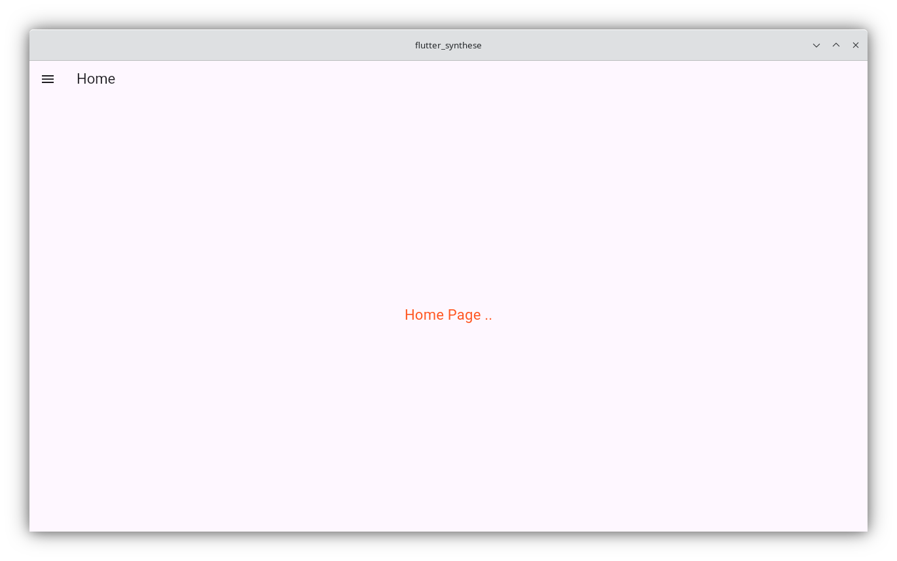
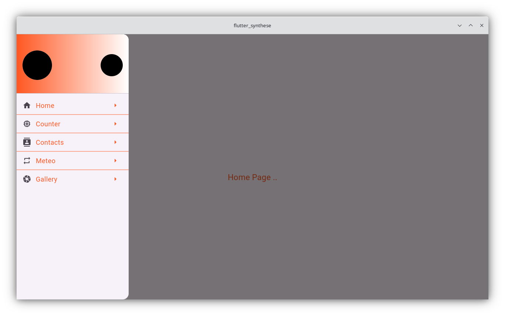
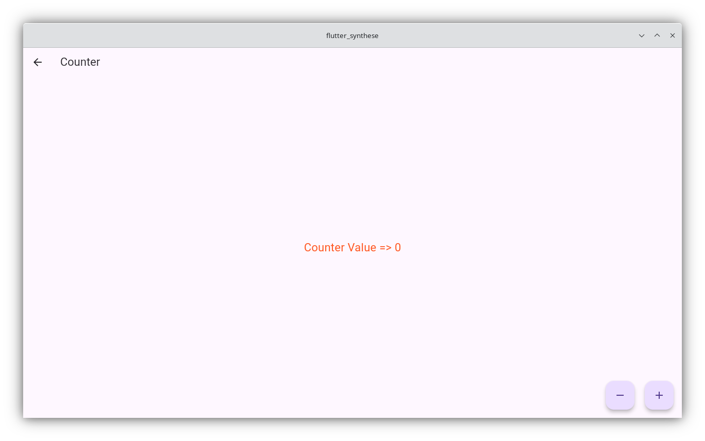
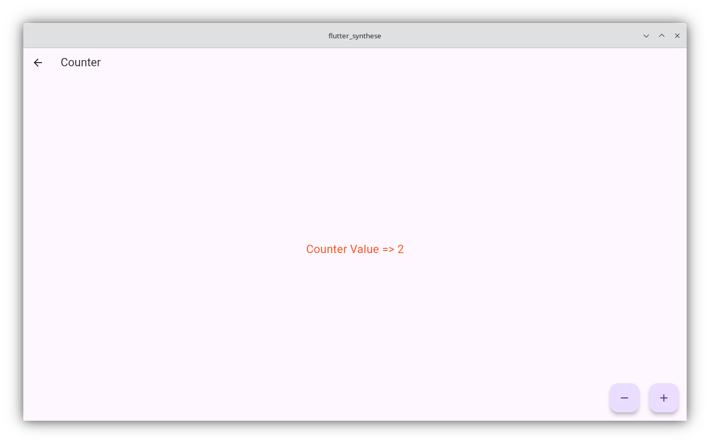
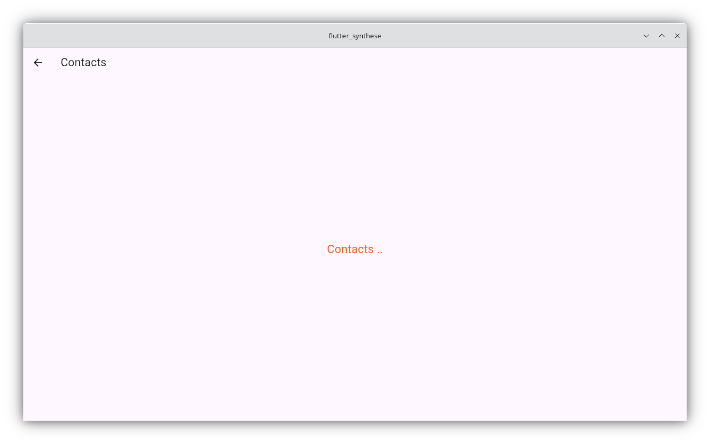
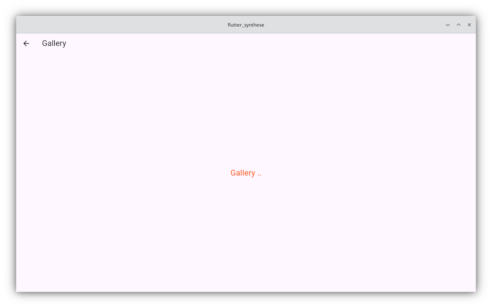

# Application de Synthèse — Flutter (OFPPT/ENSET, Partie 2)

Reproduction fidèle de l'application présentée dans le support de cours
« Intro Flutter P2 » : une `HomePage` avec un menu latéral (`Drawer`) qui
permet de naviguer vers 4 pages : **Counter**, **Contacts**, **Meteo**, **Gallery**.

## Aperçu de l'application

| Home | Menu (Drawer) |
| :---: | :---: |
|  |  |

| Counter (initial) | Counter (après incrémentation) |
| :---: | :---: |
|  |  |

| Contacts | Meteo | Gallery |
| :---: | :---: | :---: |
|  |  |  |

## Structure

```
lib/
 ├── main.dart
 ├── global/
 │    └── global.parameter.dart      # routes + définition des menus du Drawer
 ├── pages/
 │    ├── home.page.dart
 │    ├── counter.page.dart          # StatefulWidget + setState()
 │    ├── contacts.page.dart
 │    ├── meteo.page.dart
 │    └── gallery.page.dart
 └── widgets/
      ├── mydrawer.widget.dart
      ├── drawer.header.widget.dart
      └── drawer.item.widget.dart
```

## Pour lancer le projet

1. Crée un nouveau projet Flutter vide :
   ```bash
   flutter create flutter_synthese
   ```
2. Remplace le contenu du dossier `lib/` généré par les fichiers fournis ici,
   et copie aussi `pubspec.yaml`.
3. Ajoute une image nommée `logo.png` dans le dossier `images/` à la racine
   du projet (celle utilisée dans le header du Drawer). Le code gère
   silencieusement le cas où elle est absente (`onBackgroundImageError`),
   donc l'app fonctionne même sans logo.
4. Récupère les dépendances puis lance l'app :
   ```bash
   flutter pub get
   flutter run
   ```

## Points clés repris du cours

- **Routes nommées** centralisées dans `GlobalParameters.routes` et
  utilisées via `Navigator.pushNamed(context, route)`.
- **Drawer** généré dynamiquement à partir de `GlobalParameters.menus`
  (titre, route, icône).
- **CounterPage** = `StatefulWidget` avec deux `FloatingActionButton`
  (`+` / `-`) qui appellent `setState()` pour redessiner le widget.
- Les pages `Contacts`, `Meteo`, `Gallery` sont des `StatelessWidget`
  simples, prêtes à être enrichies (c'était l'exercice "À vous de coder").
